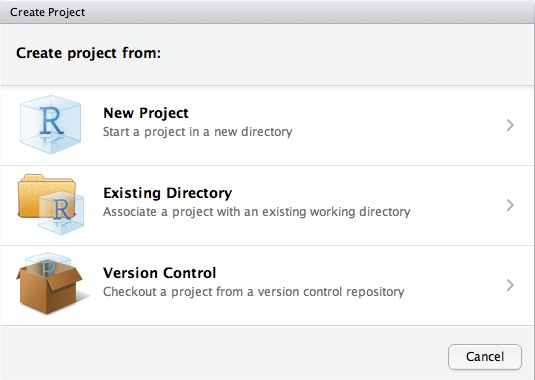
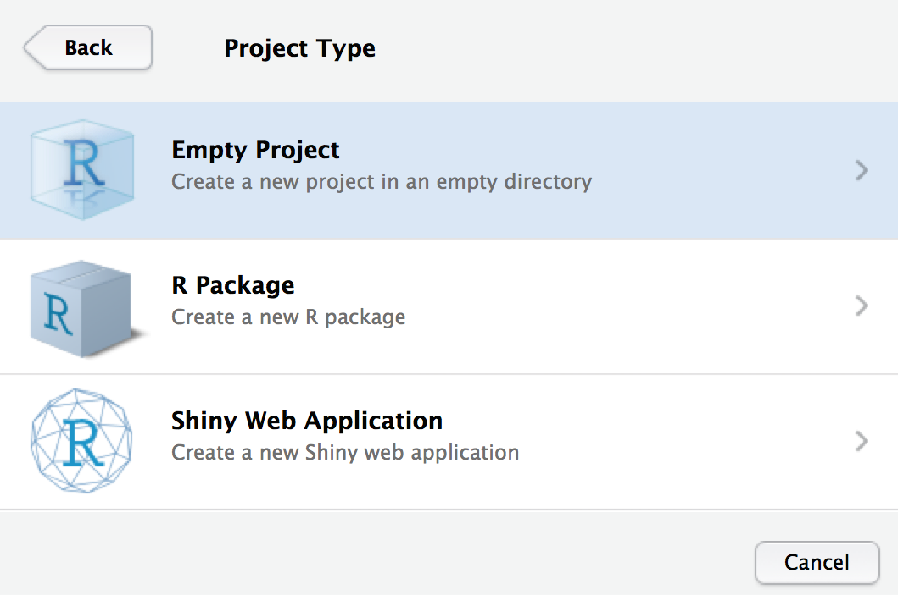
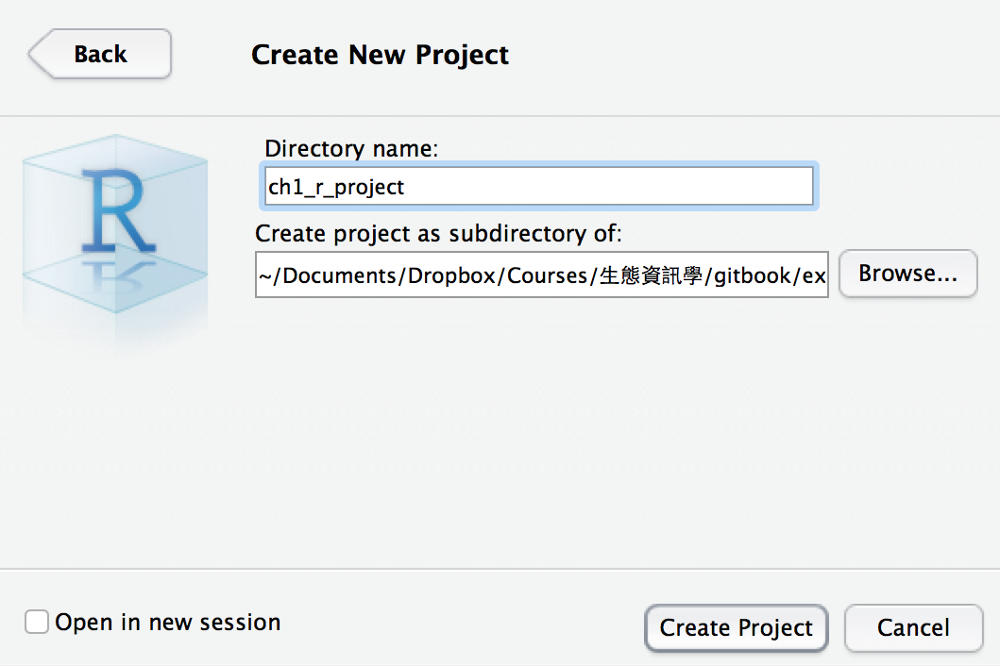
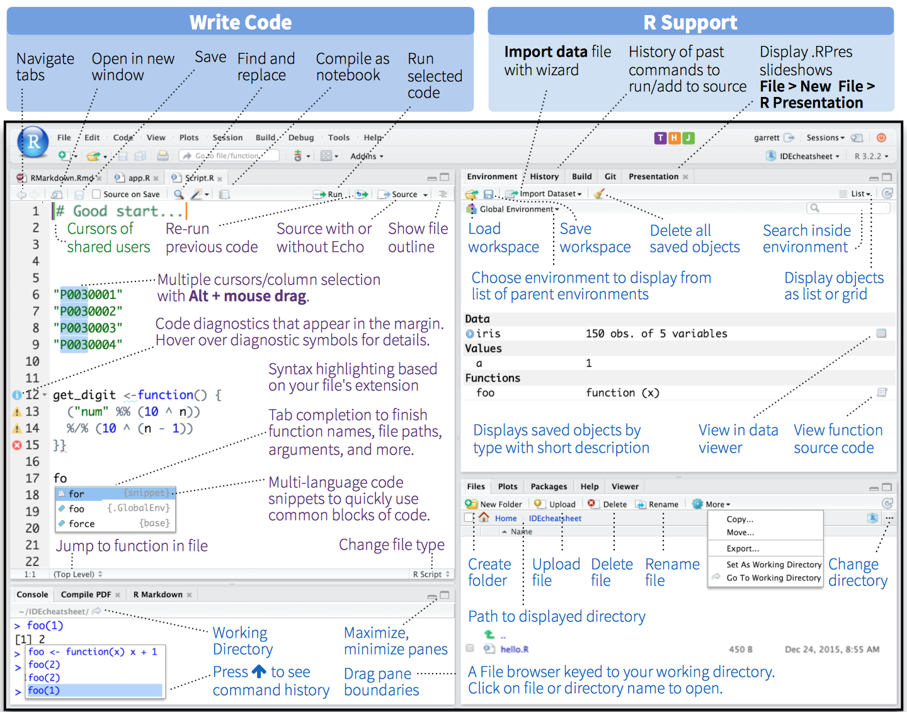
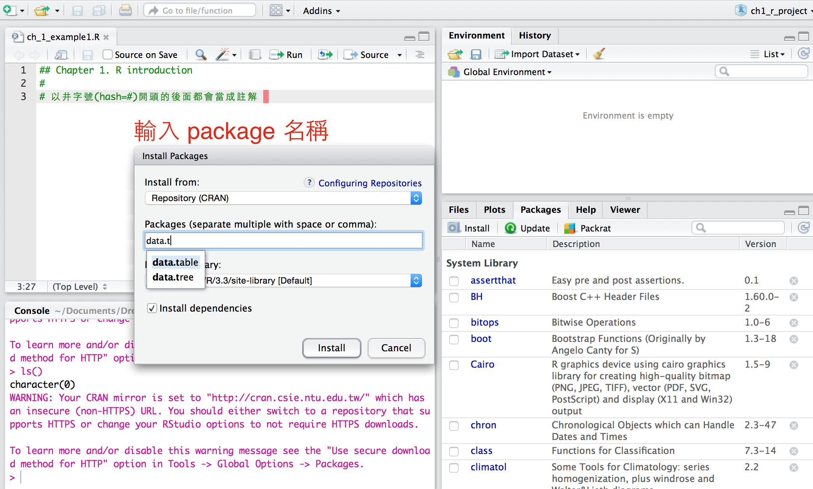

# R 的介紹

## 本章概要

本章將會介紹 R 以及 RStudio 這個整合性開發環境

## 為什麼要使用 R?

現在市面上有許多商業的專業統計軟體，例如 SAS、SPSS、Statistica 等，為什麼我要介紹各位使用 R?你可能會問，我這些資料很簡單，用 Microsoft Excel 做統計分析或 SPSS 按一按就好了，報表也都能漂亮地印出來，
為什麼還要再多花心思去學一套新的軟體?因為 R 是:

1. 百分之百自由軟體 (free software)，這意味著你可以自由取得、複製及散佈
2. 開放原始碼，R 的原始碼是公開的，你可以閱讀甚至修改
3. 龐大的使用者社群,因為自由軟體的特性,所以全世界有許多人貢獻他們的心力與 程式碼,所以許多新的統計方法可以很快就有 R 套件的支援
4. 跨平台 (cross-platform),不管你是使用 Windows, GNU/Linux, Mac OS 甚至是 FreeBSD,都可以執行 R 程式
5. 易於開發套件，你可以使用 C 或是 FORTRAN 語言開發延伸套件
6. 整合性高，可使用諸如 bash, python (rpy2) 或是 perl (RSPerl) 等語言呼叫 R 物件寫作
7. 高品質的圖形與表格排版輸出
8. 支援許多資料分析的功能，可處理大量的資料

## 安裝 R
在這個章節中,我不打算花太多的篇幅講 R 的安裝,都是重點提示，詳細的安裝說明請至 R 的網站上閱讀。R 的下載網址為 http://www.r-project.org 現在的 GNU/Linux 作業系統通常都會有套件管理程式,你可以直接從該套件管理 程式安裝 R 程式，下面以 Debian/Ubuntu 的 apt 套件管理程式為例，示範如何安裝:
終端機底下安裝 R 主程式(或是你可以從圖形化的套件管理程式來安裝)

```shell
# apt-get install r-base
```

在 Windows 作業系統中安裝 R 程式只需要下載執行檔 R-版本號碼.exe,並按照步驟安裝即可。因為 R 本身的圖形開發介面較為陽春，
在這裡我們將使用 RStudio 這套整合性的開發環境來教學，請參見下節

## 整合性圖形介面環境

雖然 R 本身是透過指令控制的，官方提供的套件也有簡單的整合性圖形介面環境可以使用，非官方的整合軟體像是 [tinn-r](http://sourceforge.net/projects/tinn-r) 或是 [RStudio](http://www.rstudio.com)等，我們推薦使用 [RStudio](http://www.rstudio.com)來進行 R 的指令寫作、測試以及管理工作環境、安裝第三方套件等功能。

### RStudio 總覽

對於常常需要使用 R 來做統計分析的人來說，RStudio是一個非常方便又強大的整合性工具。它除了基本的指令語法強化功能(syntax highlighting， 透過不同的顏色顯示函式功能、變數等，可提高程式碼的易讀性)、
[tab 鍵指令補齊](https://support.rstudio.com/hc/en-us/articles/205273297-Code-Completion)、歷史指令控制管理、資料變數管理等功能外，也整合了[版本控制系統](https://www.r-bloggers.com/rstudio-and-github/)
(version control，預設使用的是 [git](http://git-scm.com) ，需要額外安裝)、第三方套件管理、[Markdown 語法](http://rmarkdown.rstudio.com)、簡報投影片等。
除此之外，RStudio 最重要的特徵就是它也是開放原始碼軟體，而且完全免費！

* 安裝 RStudio

請至 [RStudio Desktop](https://www.rstudio.com/products/rstudio/download/) 下載安裝即可。

* 建立新專案

    首先我們用專案管理的方式來建立新專案，從 RStudio 功能選單中的 Project 項目中選擇子項目的 Create Project 建立一個新的專案，如下圖


* 接下來選擇專案類型及目錄名稱

    我們選 Empty Project 

    選擇你想要放置這個 R 專案的目錄以及這個新專案的名稱，範例名稱為 ```ch1_r_project```

    


* RStudio 介面介紹

    RStudio 有個特異的功能就是提供小抄(cheat sheet)，這個非常實用，完整
RStudio 介面小抄請參見[RStudio IDE Cheat Sheet](https://www.rstudio.com/wp-content/uploads/2016/01/rstudio-IDE-cheatsheet.pdf)，下面將會使用 RStudio 部分截圖來介紹




RStudio 開啟的時候，預設切分為左右兩部分，左半部是 R script 和 R console，
右半部則是 R 的後勤區(包括環境、變數、歷史指令、檔案、說明檔等)。詳細的說明請參見第二章—R:入門基礎。


## 安裝 R 的第三方套件

R 強大的地方除了本身語言支援許多統計的函式外，也可以安裝一些第三方套件(類似外掛)
擴充原本沒有的功能。我們可以稱這些第三方套件叫做 ```package``` 或 ```library```。安裝的方法可以直接在 RStudio 安裝，從 ```package``` 中的 ```install package``` (或是從工具列中的 Tool/Install packages 安裝)，輸入 package 名稱(輸入部分關鍵字後下方會有提示)則會透過網路自 [CRAN](https://cran.r-project.org/
) (Comprehensive R Archive Network) 安裝，如下圖所示：



## 相關 R 檔案或 code

請參見 ```examples/ch1_r_project```

## 練習

* ch1-1. 請練習安裝 R 及 RStudio 在你的電腦中
* ch1-2. 請練習 RStudio 的指令補齊功能
* ch1-3. 請下載 RStudio 的 cheat sheet 並閱讀其功能
