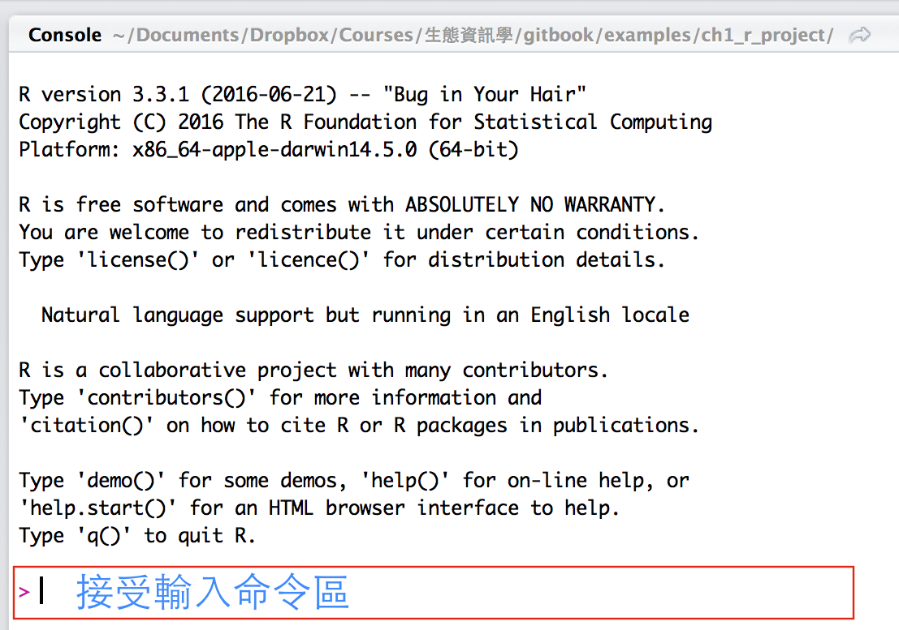

## R 的基本操作

R 一開啟的時候會出現類似[終端機](https://zh.wikipedia.org/wiki/終端)的介面顯示，
如下圖 2-1 所示，


圖 2-1、R console (這裡以 RStudio 為例)

圖 2-1 是使用 RStudio 開啟 R console。上半部顯示 R 的版本、平台(platform)、
版權的宣告及相關資訊等。最下面有個大於(>)符號，後方游標閃爍，
在這個「大於」符號後面是接受輸入命令區，你可以在這邊輸入 R 的指令。
在解釋 R console 使用之前，先解釋電腦程式語言的兩大類群，
分別為編譯式語言(compiled language)及直譯式語言(interpreted language)。
編譯式語言需要透過[編譯器(compiler)](https://zh.wikipedia.org/wiki/編譯器)
把程式碼翻譯成機器能懂得二進位碼，而直譯式語言則直接在直譯器中輸入程式碼即可。
R 語言就是一種直譯式的語言，只要把指令輸入在 R console 中，
R 就會直接執行不需要額外再透過編譯器。

在 R console 中，隨時都可以接受指令的輸入，原則上 R 會一行一行的執行，
你可以把這裡當成計算機，例如你可以試著輸入 $$ 3 \times 128 $$
(相乘使用 「*」符號，數學運算的部分後面的章節會再詳細解釋)。

```R
> 3*128
[1] 384
```

第二個例子是 5 除以 3：

```R
> 5 / 3
[1] 1.666667
```

眼尖的你可能會發現到上面的第一個例子沒有空格，第二個例子有空格。
在 R 裡面運算符號和數值之間的空格不會影響到執行的結果，
但我建議你可以在數值和運算符號中保留空格，
這可以讓閱讀 R 程式碼時更加舒適且美觀。


### 註解

在撰寫 R 語言時，只要開頭有井字號(#)的 R 都會把它視為註解。
因此不論後面再加上什麼指令或函式，R 都會把這些當成註解不執行，
例如：

```R
# 這是註解
#### 這也是註解
```

如果你有多行文字需要註解，在 RStudio 中，你可以把這幾行選取起來，
在選單 Code 中的 Comment/Uncomment Lines 把這幾行註解起來。
或是使用快速鍵 Shift-Ctrl-C (MacOS 則是 Shift-Command-C)註解。
而註解有何用處呢？就是能夠把 R 程式中額外需要解釋的，
像是某功能代表什麼意思？各個參數的限制，
有沒有什麼其他值得給自己或他人參考的文字內容等。
另外註解還有一個很重要的功能就是幫助自己回憶 code，
當你花了許多時間寫了許多 R code，過了一段時間可能忘記到底在寫些什麼，
這些註解就可以幫助你回憶。比如說下面是一個 R 函式，
我就會在函式的前方寫這個函式是在做什麼、輸入資料的類型以及參數解釋等：

```R
## [FUNCTION] Find countries in focal list and store PolySet in a vector
#
# arguments:
#   * ref_area.prj: projected area (SpatialPolygon object)
#   * focal_list: focal list
#
find_focal <- function(ref_area.prj, focal_list) {
  require(PBSmapping)
  focal_list.ps <- vector(mode="list", length=length(focal_list)) 
  for ( i in 1:length(focal_list) ) {
    # check if the focal_list names match the fieldname in ref_area.prj 
    if ( focal_list[i] %in% ref_area.prj$NAME ) {
      focal_list.ps[[i]] <- combinePolys(SpatialPolygons2PolySet(ref_area.prj[ref_area.prj$NAME==focal_list[i],]))
    } else { 
      print(paste("Error!", focal_list[i],"does not match in the reference area", sep=" ")) 
    }
  }
  return(focal_list.ps)
}

```

### 使用函式及表示式

R 裡頭執行指令或是函式(function)時，必須要加上括號，例如 ```ls()```，
如果沒有加上括號「()」，R 預設就會把其原始碼在螢幕上印出，例如:

```R
> ls
function (name, pos = -1L, envir = as.environment(pos), all.names = FALSE,
    pattern, sorted = TRUE)
{
    if (!missing(name)) {
    ... 中間省略 ...
            }
        }
        grep(pattern, all.names, value = TRUE)
    }
    else all.names
}
<bytecode: 0x1039a66e0>
<environment: namespace:base>
```

若輸入的指令為 ```ls()``` 時才會正確去執行該函式，即：

```R
> ls()
character(0)
```

### 指定變數(variables)

對於複雜一點的 R 程式，也許你會想有沒有什麼其他的方式可以重複使用計算過的數值、
或是執行過的函式呢？舉例來說，我想計算 15 塊錢美金可以換算成多少新臺幣，
假設一塊美金可以換成 31.53 新臺幣，R 可以這樣計算：

```R
> 15 * 31.53
[1] 472.95
```

但每天的美金兌換新臺幣的匯率都不同，這個時候我們就可以把「匯率」當成一個「變數(variable)」，
顧名思義，變數就是會「變」動的「數」值(或文字、函式等)。
所以我們用變數的概念來呈現上述的例子：

```R
變數名稱 <- 數值或文字、函式
```

其中 ```<-``` 代表「指定(assign)」的意思，在 R 的語法中，你也可以使用 ```=``` 
來代表「指定」變數或函式，但為了不讓初學者和邏輯上的相等
(R 使用兩個等號 ```==```)混淆，在這裡我們建議使用 ```<-``` 來代表指定變數。
因此計算匯率的語法可以這麼寫：

```R
# 把 USDTWD 這個變數指定數值為 31.53
> USDTWD <- 31.53
# 計算 15 塊美金等於多少新臺幣
> 15 * USDTWD
[1] 472.95
```

另外，當你選擇變數的時候，可能會有數值或文字的差異，在 R 和 Excel 不同的是，
R 在處理數值或文字資料時必須先定義好其類型，
一般來說 R 的資料分為數值類及文字類這兩大類型。如果是數值類型的資料，
使用時直接輸入數字即可，例如：

```R
> a_number <- 123.5
> a_numer
[1] 123.5
> b_number <- 50
> b_number
[1] 50
```

若是文字資料，則需要加上引號('')或雙引號("")，例如：

```R
> character_a <- 'Veni, vici, vidi'
> character_a
[1] "Veni, vici, vidi"
> character_b <- "Hello world!"
> character_b
[1] "Hello world!"
```

像上面例子的文字資料，通常我們稱字串(string)或是文字(character)。
而數值資料則包括整數(integer)、實數(numeric)、雙精確數(double-precision number)、
複數(complex)等。另外還有一類特殊的資料類型，
在 R 裡頭會使用 ```NA``` (Not Available; 不是數值或不存在此物件，
通常是缺乏資料) 或 ```NaN``` (Not a Number; 不屬於數值)來表示。
若數值資料無限大，則是使用 ```inf``` 來表示。

