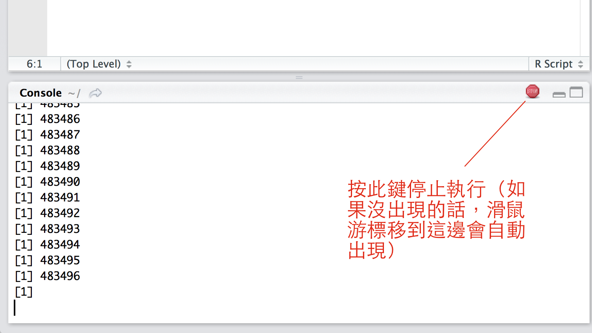

## R 的流程控制

很多生物或生態背景的人看到「程式設計」都會有點恐懼，其實程式設計並不難，基本上就是了解語法及邏輯。在這節我們會用簡單的例子來介紹 R 的程式設計，尤其是流程控制(flow control)這部份。
相信許多人都會畫簡易的流程圖，這部份的流程控制就是把流程圖轉換成文字來告訴 R 該怎麼執行。流程控制在程式語言中有個專有名詞稱為「控制結構(control structure)」，通常在一般的程式語言中，有循序(sequence)、選擇(selection)以及重複(repitition)三種類別。「循序」就是由上至下一行一行的依照順序執行，我們在寫 R 程式碼時大部分都是循序的執行；「選擇」則是有許多不同的條件，如果符合條件的話，
就會依照條件下來執行；「重複」字面上來看就是不斷地重複執行某些工作。

我們用生活中的例子來說來協助理解，例如使用洗衣機洗衣服，在 R 程式設計中該怎麼用控制結構呢？

控制結構:
> 1. 洗衣機有插電嗎？<br/>
>    有：進行步驟 2 <br/>
>    無：插上插頭後，進行步驟 2 <br/>
> 2. 放髒衣服進洗衣槽

在 R 的流程控制中，即使是像洗衣機插上插頭這種細節都必須要寫進去。
所以我們接下來先看一下 R 裡頭的控制結構有哪些，再分別一個一個來仔細說明。

### 邏輯判斷


### R 中的控制結構總覽

在 R 裡頭的控制結構總覽請參見下表，細節將會在後面的部份解釋

表 2-1. R 的控制總覽表

| R 的控制結構 | 類型  |  解釋                      | 語法          |
| ------------ | ----- | -------------------------- | ------------- |
| if ... else  | 選擇  | 如果 ... 然後              | if ( _condition_ ) _expression_ else _expression_|
| ifelse       | 選擇  | 如果 ... 然後              | ifelse(_testCondition_, _yes_, _no_) |
| switch       | 選擇  | 根據條件切換               | switch(_expression_, ...) |
| for          | 重複  | 變數在某序列下，重複執行   | for ( _variable_ in _sequence_) _expression_ |
| while        | 重複  | 根據某些條件下，重複執行   | while ( _condition_ ) _expression_ |


#### 選擇：ifelse, if-else 及 switch

在選擇的控制結構中，簡單來說就是「**如果(if)**發生一件事情**然後(then)**做些什麼」，
例如：**如果**今天下雨，**然後**出門你要記得帶傘。若把它翻譯成 R 可以理解的語言，我們可以這樣寫

```R
如果 ( 下雨了 ) {
   出門記得帶傘
}
```

注意，上面的程式碼(code)並非可以直接執行的，只是示意，我們通常稱這樣的程式碼為 虛擬程式碼([pseudocode](https://en.wikipedia.org/wiki/Pseudocode))。
使用虛擬程式碼可以幫助你先將複雜的演算法(algorithm，或籠統稱為「作法」)
的概念用常人比較容易懂的方式寫出來，之後就可以轉換成該語言之程式碼。

R 的語法如下:

```R
ifelse( testCondition, yes, no)

```
如果有個變數 val 的數值，我們想判斷這個變數是否大於 10，在 R 可以寫成
```R
ifelse( val > 10, 'Yes', 'No')
```
如果變數 val 大於 10， R 就會顯示 "Yes"，反之則是 "No"

若選擇的控制結構比較複雜，可以用大括號把 ```expression``` 包起來，如下：

```R
if ( condition ) {
    expression
} else {
    expression
}
```

其中 ```condition``` 指的是判斷的條件。而 ```expression``` 則是要陳述的表示式(字面上有點難理解，不過就是諸如運算式、
印出資料等都是 ```expression```)。你也可以只寫 ```if``` 而不用加上 ```else```。若你需要做條件判斷的情形比較複雜，
即超過兩個以上的條件判斷，可以使用 ```if``` 加上 ```elseif``` ，最後再使用 ```else```來處理，例如：

```R
# 隨機產生一個數值
a = rnorm(1)
# if-elseif-else 選擇
if ( a < 5 ) {
  print("a is less than 5")
} else if ( a > 0 ) {
  print("a is between 0 to 5")
} else {
  print("a is greater than 5")
}
```

#### 重複

<<<<<<< HEAD
重複執行某些動作，在 R 的語法可以使用 ```for``` 迴圈(loop)或 ```while``` 迴圈。
迴圈代表重複執行某些動作，例如我想在 R console 中印出 1, 2, 3, ... 一直到 100：

```R
# 印出 1, 2, 3
> print(1)
[1] 1
> print(2)
[1] 2
> print(3)
[1] 3
> print(4)
[1] 4
... (以下省略) ...
> print(100)
[1] 100
```

這個時候如果每印出一個數字，就要輸入 ```print(n)```，不就要 100 行 code 才能完成嗎？
所以迴圈就可以解決這類重複執行的動作，同樣印出 1 至 100，使用 ```for``` 迴圈可以這樣做：

```R
for ( i in 1:100 ){
    print(i)
}
```

```for``` 迴圈的語法如下，括號內包的是執行動作時的序列：

```R
for ( 序列 ){
    執行動作
}
```

另外一個迴圈則是 ```while```，如果同樣印出 1 至 100 的數字，```while``` 
迴圈則要寫成：

```
# 先把 i 的起始數值設定為 1
i <- 1
while ( i <= 100 ){
    # 印出 i 的數值
    print(i)
    # 接下來設定 i' = i + 1，也就是每印完一個數字後，
    # i 自動加 1
    i <- i + 1
}
```

有注意到嗎？在 ```for``` 迴圈中，括號內要設定好一個序列，例如 1 至 100 (R 的語法 ```1:100```)，
但 ```while``` 則是限定在某個條件下，以本例來說就是 i 小於等於 100 時，
R 才會重複大括號內的執行動作。如果今天寫 ```while ( 1+1 == 2 )``` 時，
這個迴圈就會變成「無窮迴圈」了，R 會一直執行他到天荒地老永遠都不會停！
如果你不幸的沒寫好讓它變成無窮迴圈的話，你只要按 RStudio 的 R console 右上角的 stop 就可以停止執行，
或是在非 RStudio 介面下，按 Ctrl + c 來強迫中斷執行。





=======
>>>>>>> 0898a4c54d88fe1661679373b0cf22781d8b66d7
