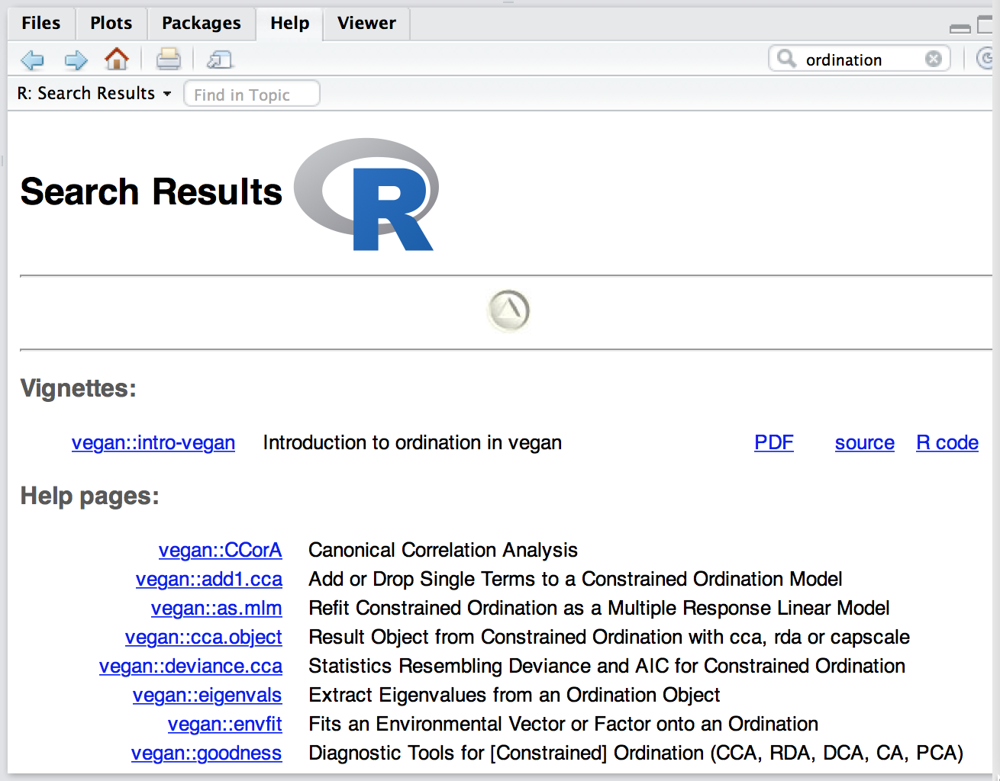
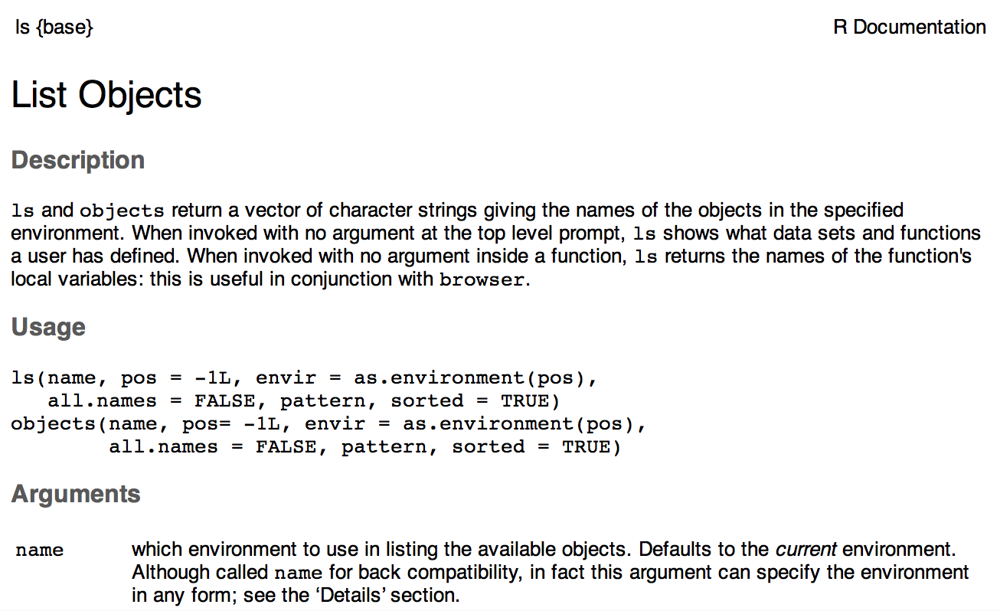
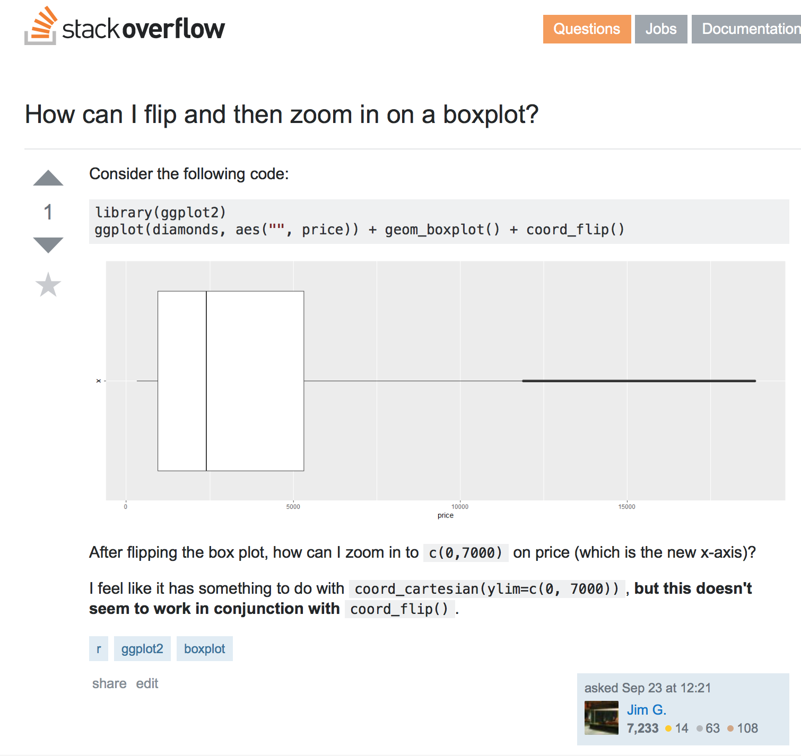

# R 入門基礎

> 如果你已經對於 R 的基本操作有概念了，可以跳過這章。
如果你在後面的章節碰到問題，可以隨時來這裡查詢怎麼嘗試自己解決問題。

這個章節主要是引領各位進行 R 的實際操作。
一開始會先教各位如何使用 R 的 console 介面，
然後教導如何善用說明文件以及網路上的資源,最後則是介紹物件、資料類型、
基礎數學運算以及資料處理等。在讀完本章節之後,你將會學習到:

* 了解怎麼善用網路資源、內建說明手冊查詢指令及關鍵字
* 如何使用 R console 互動式輸入指令
* 使用 R 做基本數學運算
* 了解 R 的資料結構以及屬性
* 了解基本的 R 程式的流程控制
* 可以從外部把資料輸入進 R 及輸出
* 知道怎麼進行資料處理及資料探索(data explore)


## 自學 R 的要訣


R 的設計本身就很適合拿來自習，一開始如果沒有接觸過 UNIX 作業系統的人，
通常會覺得 R 很難上手，而且都是使用指令來操作一定很不容易。雖說如此，
R 的學習曲線在一開始會很陡，但是一旦習慣 R 的模式之後，
後續的操作就會無往不利，你可以靠著眾多網路資源、經驗配合
R 本身彈性的設計來發揮你的創意，
有許多分析和資料處理往往只需要腦筋轉個彎就能夠達成。這個章節會從怎麼閱讀
R 的說明檔開始、如何「有智慧地問問題」以及利用網路資源進行疑難排解。

## 讀懂 R 的說明檔

在開始下一個階段教學之前，我想先花一些篇幅介紹 R 的說明檔。
我認識許多人常說，R 裡頭的說明不知道在寫什麼耶，完全不了解它的明白！
看起來寫的很詳細，但讀起來卻有點似懂非懂。
這是因為 R 的前身 S 語言是從 UNIX 作業系統所開發出來的，
這些資訊科學的前輩們，邏輯思考易於常人的清晰，
說明檔的內容及格式也都有嚴格的定義及規範。
R 受到了 UNIX 文件的影響，讀起來則和一般的文件不太一樣，但是仔細閱讀，
你會發現這些文件都寫的十分詳細，
只是閱讀上需要有一些技巧(當然不要被英文給嚇到了！大部分的英文都是很淺顯易懂的)。
接下來我們一步一步來解析 R 的文件。


查閱 R 的文件有幾種方式，如果你知道某個特定套件的函式 (function)，你可以在 R console 中輸入```?函式名稱```，就會直接顯示該函式的說明。
如果你僅知道某些關鍵字，但不知道是在哪個特定的套件中之函式，
你可以使用```??關鍵字```來查詢。如果你搜尋到某些套件，安裝完畢某套件之後，
想要知道這個套件的簡介，還有它的功能、函式等，可以使用```help(package=套件名稱```」來閱讀。例如我們如果要查維度分析(ordination)這個關鍵字，
我們先使用 ```??ordination``` 來查詢，在一般的 R Console 中會顯示如下：

```R
# 查詢特定關鍵字
> ??ordination
Vignettes with name or keyword or title matching ‘ordination’
using fuzzy matching:

vegan::intro-vegan      Introduction to ordination in vegan

(略)

Help files with alias or concept or title matching ‘ordination’
using fuzzy matching:


(略)
vegan::ordiplot         Alternative plot and identify Functions
                        for Ordination
(略)
```

若是使用 RStudio，上面的顯示會用比較美觀的 HTML 排版在
Help 區域(預設是右下角)，如下圖：




查詢時可看到兩大類說明文件，分別為 ```Vignettes```(短文簡介) 和 ```Help pages```(說明頁面)。
```Vignettes``` 原意指的是小品文，在 R 裡頭指的是相對篇幅比較長的說明文件，
我們暫且稱之為「短文簡介」，在一個第三方套件的短文簡介中，
會詳細交代這個套件有哪些功能，有些甚至會寫簡單的統計原理、範例、
圖表等有助於讀者理解的內容。
而一般的說明頁面僅會記載套件功能、簡要敘述等，細節後面會再提到。
所以應該怎麼閱讀呢？如果你已經對這個套件有一定的熟悉度，知道函式名稱，
只是想查詢參數(arguments)怎麼用，你可以直接閱讀說明頁面。
但你安裝了一個新的第三方套件，完全不知道有哪些函式功能可用，
如果這時候你直接查每個函式說明頁面一定會一頭霧水不知該如何下手，
這時候閱讀 R 的「短文簡介」就是一個好的出發點，
你可以從頭閱讀，知道大致上這個套件的目的、基本的功能，
也能直接從範例中學習。以下為 ```vegan``` 套件中的 ```intro-vegan```摘要：

> The document describes typical, simple work pathways of vegetation ordination. Unconstrained ordination uses as examples detrended correspondence analysis and non-metric multidimensional scaling, and shows how to interpret their results by fitting environmental vectors and factors or smooth environmental surfaces to the graph. The basic plotting command, and more advanced plotting commands for congested plots are also discussed, as well as adding items such as ellipses, convex hulls, and other items for classes. The constrained ordination uses constrained (canonical) correspondence analysis as an example. It is first shown how a model is defined, then the document discusses model building and signficance tests of the whole analysis, single constraints and axes.


裡頭解釋了 ```vegan``` 這個套件在做什麼(simple work pathways of vegetation ordination)，分別有哪些功能等。但是如果是一般的 help pages，
其結構僅有函式敘述(description)、簡要使用方法(usage)、參數(arguments)、
使用細節(details)、作者(authors)、參照(see also)及範例(examples)等主題。
我們舉例來說明，下圖是查詢 ```ls``` 的說明頁面部分截圖：



在最左上角顯示 ```ls {base}``` 代表是 base (R 的基本元件) 中的函式 ```ls```，
如果是第三方套件的話，大括號內則會顯示其套件名稱。接下來 ```List Objects```
代表了 ```ls``` 這個函式的標題，例如本例中為列出物件(list objects)。
下表列出說明頁面中的主題及其說明：

| 主題               | 說明                  |
| ------------------ | --------------------- |
| Description        | 簡單敘述這個函式功能  |
| Usage              | 簡要描述怎麼使用      |
| Arguments          | 參數名稱及細節        |
| Details            | 細節說明              |
| Authors            | 作者資訊              |
| See Also           | 參照相關的指令或函式  |
| Examples           | 範例                  |

在 Examples 裡頭，列出了範例 code，如果你想知道執行的結果，
可以使用 ```example()``` 來執行，例如 ```example(ls)```。

另外你可能會發現到搜尋時會顯示像 ```vegan::intro-vegan```、
```vegan::ordiplot``` 中間會有兩個冒號(:)，這代表「命名空間(namespace)」，
在上述的例子中，```vegan```代表套件的名稱，
兩個冒號後方代表 ```vegan``` 套件中的函式名稱。為什麼要這樣做呢？
這是為了要解決不同命名空間中可能有函式名稱衝突的問題，
假設 A 套件中有個功能叫做 ```plot()```，和 ```graphics``` 裡頭的 ```plot()```
一模一樣，如果你在 R console 中輸入 ```plot()```，預設會是 ```graphics```
的 ```plot()```，若你要呼叫 A 套件中的 ```plot()```，此時就要使用
```A::plot()``` 來執行。強制使用命名空間是 R 2.14.0 版本之後才開始的，
更早之前的 R 版本是沒有的，關於 namespace 的說明可以參考


## 如何有智慧地問問題

> 這小節改寫自「[如何有效率的「問」問題](http://mutolisp.logdown.com/posts/208213-how-to-effectively-asking-questions)」

談到有智慧地問問題之前，一定得提及[Eric Raymond](http://en.wikipedia.org/wiki/Eric_S._Raymond)。
Eric 寫了一篇很有名的文章來論述

他寫了一篇《[教堂與市集](https://zh.wikipedia.org/wiki/大教堂和市集)》的資深駭客，堪稱為自由軟體界的歷史學家)寫了一篇《[How to ask question the smart way](http://www.catb.org/esr/faqs/smart-questions.html)》，直到今年五月份 esr 仍然還有修訂這份經典之作。如果你沒有讀過這份文件，我__強烈__建議你讀一次，雖然是英文的，但文件本身非常輕鬆好讀。

簡單講一下一些大原則，在你提出問題時，可以問看看你自己。

##搜尋

* 你真的有好好用過 Google / DuckDuckGO 等搜尋引擎找關鍵字嗎？(關鍵字：stackexchange, stackoverflow)
* 你真的搜尋不到你要的相關主題或提示嗎？
* 拼字有拼對嗎？

搜尋主要是要有針對性與特定的問題，才能比較好過濾資訊，這個每個人都會有一些小撇步。依照我的經驗法則，通常可以用「方法」加上「使用軟體/步驟」及「文件類型」等來搭配，常常在搜尋引擎前三到四個頁面就可以找到我想要的答案(但當你什麼都不懂時，請先去學校上基礎課程，或是找一些 open course 來自修)。例如：

我想要找空間資訊中的交集問題，你可以用
```
gis + intersection
```
但這樣的結果往往是出現最多人使用/或最常被搜索的關鍵字，所以若你已經知道有哪些軟體或方式可以做，你可以嘗試修改一下關鍵字：
```
postgis + intersection
```
但這樣的搜尋結果也許不盡滿意，如果只是想看一下 postgis 做交集的範例說明，可以用下列的關鍵字搜尋：
```
postgis + intersection + tutorial
```
若你不是想找文件和教學，而是實際上遇到了問題卡住，例如你今天做交集時，遇到 ```ERROR:  function st_intersect(geometry, raster) does not exist```，也許你可以用:
```
postgis + st_intersect + error
```
來找尋相關的解法（上述例子是 st_intersect() 拼錯字，字尾少了一個 s，這個有可能會有搜尋引擎自動幫你更正）


##提出問題

我舉幾個最近有人問我的問題來回答（為了相關人的隱私，所以只節錄問題主幹，
問候語與署名等皆去除），這樣比較容易讓大家了解為什麼要這樣問，
別人問的問題也許就是你想問的問題。

* 範例一

    > ... 我想請問你
    > 未來氣候資料的兩個子情境因子
    > A,B 兩個分別是代表什麼啊??

    **解析**：

    > 這個例子中，很明顯就是事主連搜尋都不願意花功夫，
    即使用「未來氣候+情境+A+B」這樣的中文關鍵字也能找到答案。
    如果你問我這個問題，我回答的意願趨近於零。


* 範例二

    > ... 今天老師覺得上次請你幫忙的DEM及坡度好像又有問題
    > 你上次給我的檔，之後老師有再轉成網格檔，我再切成各行政區，然後再用ZONAL STAT算出每個地籍的平均坡度。
    > 也許是我轉檔的過程中又有問題，但一時間也想不出來 ...

    **解析**：

    > 這個「問題」的問題出在語焉不詳，雖然已經有提出使用的方法，但是過程仍然沒有交代清楚。以下舉幾個常犯的錯誤（我以前也是有犯過類似的錯誤）：

    > 1. 這個看起來怪怪的（哪裡怪？有像怪老子一樣怪嗎？）
    > 2. 看起來有問題（怎麼看？閉著一隻眼睛看？還是倒立看？）
    > 3. 算出平均坡度後有問題（你怎麼算的？）

    事主一直遇到問題，一直問了「問題」，但是沒有詳細的步驟，
    也很難有人想回答這個問題。

    但如果你這樣問問題，我會樂意幫你找出解答：

    我用 ```gdaldem``` 把你上次給我的 dem.tiff 檔案轉成坡度檔，轉檔的方式為：

    ```gdaldem slope dem.tiff slope.tiff```

    但我用 ArcMap 匯入 slope.tiff 和之前做的 slope2013.tiff
    比較後發現數值差很大，附檔是我用 arctoolbox 中的zonal statistics
    計算 land.shp 和 slope.tiff 的輸出值.... （後略）

    如果是這樣問問題，我就能馬上告訴事主，
    他使用的 ```gdaldem``` 少加了一個參數 ```-p``` (gdaldem 預設是計算「度」，
    要加 p 才會計算 percent），只需要我看完問題就能馬上告訴事主問題點在哪。


* 範例三

    > ... 匯入X.Y點位後要輸出成shapefile檔，可是檢查資料夾時卻只看到look檔，
    是哪裡出問題了呢？
    >

    **解析**

    我會問你的是：

    你用什麼軟體做？ArcGIS/QGIS/R? 什麼是 look 檔？是附檔名 .look
    (當然我猜有可能是 .lock 檔）？還是資料夾中只有 look 這個檔案或目錄？
    然後我就覺得很麻煩，你問我問題我還需要擲杯問一下媽祖還是土地公，
    回答的意願也是趨近於零。

    若你這樣問問題：
    ```
    題目：我用 ArcMap 10.0 版將 xy 座標匯入後，轉成 shape 檔失敗，並只出現附檔名為 .look 的檔案，請問如何解決呢？

    使用的軟體及輸入格式：
    ArcMap 10.0
    xy 座標檔案格式： csv

    步驟：
    將 csv 檔案匯入 ArcMap 中後，按右鍵 display xy，接下來載入該圖層後，另存新檔至 C:/tmp/ 則出現失敗字樣
    error 代碼及訊息如下
    ...(略）...
    重複數次都是得到相同的結果，請問這個問題大概出在哪邊呢？
    ```
    上面的方式有附上錯誤訊息及相關的操作步驟，會更容易找出錯誤在哪。
    有時候我光是把作法寫下來，看一下錯誤訊息，透過搜尋相關的問答，
    換個方法或調整錯誤的參數，試一下大概就能解決了。

最後請記得，沒有人有義務回答你的任何問題，大家都是花了自己額外的時間和精神互相幫忙，在別人幫你之前，請你自己先幫自己，作業要自己做，不要抄別人的。

## 自行找解答的模式

讀完「有智慧地問問題」後，你可以試著查詢 [Stackoverflow](http://stackoverflow.com) 上的問答。Stackoverflow 是一個專為「問問題」然後提供解答的網站，
這裡的問題都是有明確解答的，但不包含「什麼是生命？」這類開放式的問題，
例如：「 R 要如何匯入 Excel 的檔案？」這樣的問題。在 Stackoverflow
上發問都有人投票，如果你的問題問的清楚且容易理解，
就會有其他人可以票選提昇你的問題能見度。回答問題也是類似的模式，
若你回答其他人的問題時，其他人認為你的回答能解決提問者的問題或對他而言是有用的，
此時其他人也能投票增加你的問題能見度。反之若你的問題不知所云或回答錯誤，
投票評比則會減分，降低你提問或回答的能見度。
所有在 Stackoverflow 上的問答都會賺取名譽(reputation)分數，
累積到一定的分數才能投票或修改別人問題等權限。

下圖為問問題的截圖，左方可投票


你可以參閱 [How can I flip and then zoom in on a boxplot](http://stackoverflow.com/questions/39660668/how-can-i-flip-and-then-zoom-in-on-a-boxplot) 這個問題，底下的回答有加分也有減分的。

相關 R 的問題可以參見
[R tagged questions](http://stackoverflow.com/questions/tagged/r)，
在你遭遇到困難時，請記得把你的問題詳細寫出來，
試著先自己找解答並善用 Stackoverflow 上別人曾問過的問題解答。


