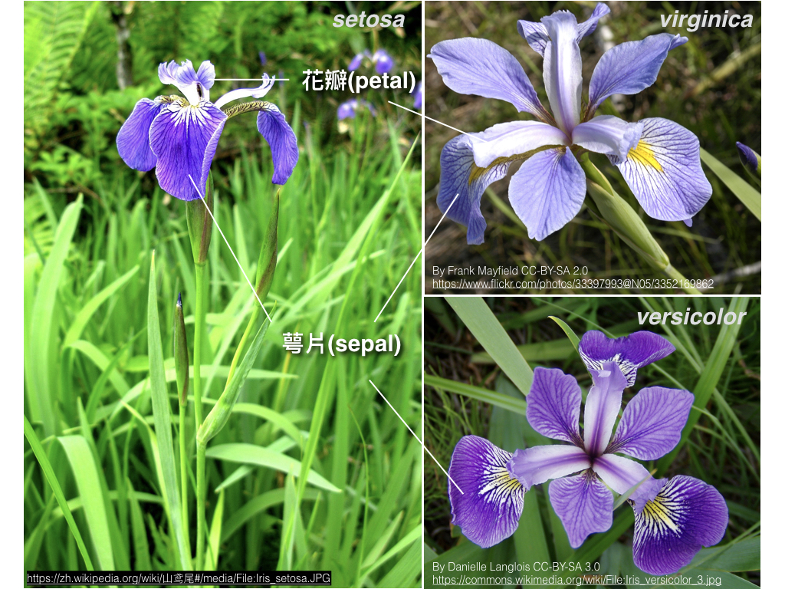
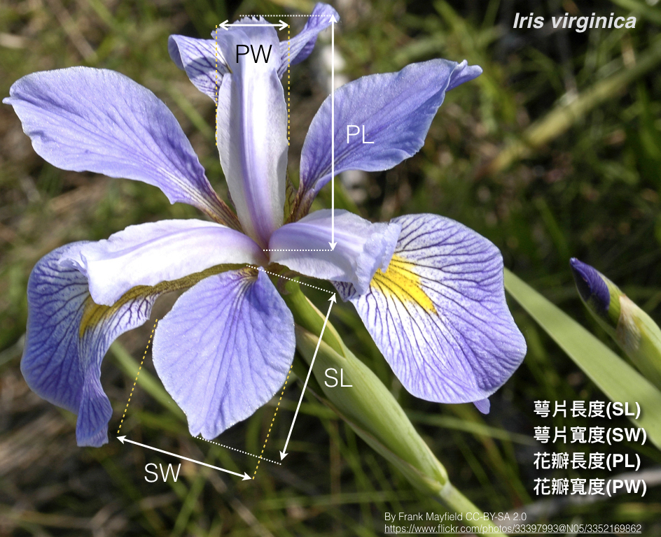

# 基礎統計分析

本章主要是介紹如何使用 R 進行基礎的統計分析，
下個章節則是進階的統計分析。本章主要的學習目標如下：

* 能使用 R 做敘述統計，包括

    * t-test 
    * 變異數分析
    * 簡單線性迴歸


## 範例資料：鴛尾花資料集(iris data set)

在 R 的範例資料中有個很有名的資料集稱為 iris data set，
這個資料集量測了三種鴛尾的花瓣及萼片等形質資料，分別為山鳶尾(*Iris setosa*)、
變色鳶尾(*I. versicolor*)及維吉尼亞鴛尾(*I. virginica*)。
為了讓大家更容易進入狀況，這三種鴛尾的花及形態特徵參見下圖。



鴛尾花的資料是 1935 年由 Edgar Anderson 量測收集的，後來費雪(Ronald Fisher)在其 1936 
年的論文中使用這些資料做為線性判別分析(linear discriminant analysis)統計的範例，
自此鴛尾花的資料及廣泛運用在統計教學以及機器學習領域中做為範例。
在 R 裡頭可以直接使用 ```iris``` 來呼叫鴛尾花資料集：

```R
> iris
Sepal.Length Sepal.Width Petal.Length Petal.Width    Species
1            5.1         3.5          1.4         0.2     setosa
2            4.9         3.0          1.4         0.2     setosa
3            4.7         3.2          1.3         0.2     setosa
... (skip) ...
148          6.5         3.0          5.2         2.0  virginica
149          6.2         3.4          5.4         2.3  virginica
150          5.9         3.0          5.1         1.8  virginica
```

鴛尾花資料集總共有 150 筆資料，我們把每個物種各取兩筆，列在下表說明：

| id  |  Sepal Length  | Sepal Width | Petal Length | Petal Width | Species    |
| --: | -------------: | ----------: | -----------: | ----------: | ---------: |
| 1   |  5.1           | 3.5         |  1.4         | 0.2         |     setosa |
| 2   |  4.9           | 3.0         |  1.4         | 0.2         |     setosa |
| 51  |  7.0           | 3.2         |  4.7         | 1.4         | versicolor |
| 52  |  6.4           | 3.2         |  4.5         | 1.5         | versicolor |
| 101 |  6.3           | 3.3         |  6.0         | 2.5         |  virginica |
| 102 |  5.8           | 2.7         |  5.1         | 1.9         |  virginica |

Anderson 量測了四類花的形質資料，分別是花瓣長度(petal length)、花瓣寬度(petal width)、
萼片長度(sepal length)以及萼片寬度(sepal width)，單位都是公分。形態上的示意請參見下圖：



## 統計的第一步

當我們拿到一筆資料時，首先將資料輸入進 R (請參見 R 的輸出入)，並瀏覽一下這筆資料的「外觀」。
所謂「外觀」指的是資料的維度、資料筆數、欄位名稱定義、數值類型等。
這些可以有助於我們在後續做統計分析時對量測資料的背景有一些認識，尤其生態的量測資料有其生態意義，
如果可以最好讀一些背景資料或到野外實際訪視「感覺」一下。畢竟生態研究注重的是生物及環境之間的關係，
花點精力進入狀況除了可以有正確的認知外，
也能避免 [garbage in, garbage out](https://en.wikipedia.org/wiki/Garbage_in,_garbage_out)
的情形發生。

第一步通常會使用 ```summary()``` 對資料進行摘要檢視：

```R
> summary(iris)
  Sepal.Length    Sepal.Width     Petal.Length    Petal.Width   
 Min.   :4.300   Min.   :2.000   Min.   :1.000   Min.   :0.100  
 1st Qu.:5.100   1st Qu.:2.800   1st Qu.:1.600   1st Qu.:0.300  
 Median :5.800   Median :3.000   Median :4.350   Median :1.300  
 Mean   :5.843   Mean   :3.057   Mean   :3.758   Mean   :1.199  
 3rd Qu.:6.400   3rd Qu.:3.300   3rd Qu.:5.100   3rd Qu.:1.800  
 Max.   :7.900   Max.   :4.400   Max.   :6.900   Max.   :2.500  
       Species  
 setosa    :50  
 versicolor:50  
 virginica :50  
```

```summary()``` 函式會將每個變項(variable)的最大值(Max. = maximum)、
最小值(Min. = minimum)、第一四分位數(1st Qu. = 1st quartile)、
第二四分位數(即中位數 Median)及第三四分位數(3rd Qu. = 3rd quartile)
等計算出來。例如在鴛尾花資料集中，我們就可以透過 ```summary()``` 
看出這些敘述統計的摘要。

### 計算平均、標準差、變異數分析等

計算平均可以使用 ```mean()```、標準差為 ```sd()```：
```R
# 萼片的平均長度
> mean(iris$Sepal.Length)
[1] 5.843333
# 萼片的平均寬度
> mean(iris$Sepal.Width)
[1] 3.057333
# 萼片的標準差
> sd(iris$Sepal.Length)
[1] 0.8280661
```


### 資料的聚集(aggregate)

在處理資料時，有時候會需要針對某一個變項做統計，在 R 中應該要怎麼做呢？
以鴛尾花資料為例，如果我們想要看每個物種各自花瓣長度(petal length)的平均是多少，
可以使用 ```aggregate()``` 函式來處理。

> ```aggregate(需計算的資料變項, 依據的變項, 函數)```

或是

> ```aggregate(表示式, 資料集, 函數)```

R 語法如下：

```R
> aggregate(iris$Petal.Length, by = list(iris$Species), FUN = mean)
     Group.1     x
1     setosa 1.462
2 versicolor 4.260
3  virginica 5.552
# 或是使用表示式
> aggregate(Petal.Length ~ Species, data = iris, FUN = mean)
     Species Petal.Length
1     setosa        1.462
2 versicolor        4.260
3  virginica        5.552
```

其中 ```~``` (波浪符號，又稱為「毛毛蟲」；tilde operator) 在 R 中的定義為下：

> 假設有個方程式 $$y = x_1 + x_2 + x_3$$，$$y$$ 為應變數、$$x_1, x_2, x_3$$ 為自變數，
R 中若有進行迴歸或相關統計計算時，會以 ```y ~ x1 + x2 + x3``` 來表示。
因此上面的 ```aggregate()``` 中的參數表示：以 species 為自變數，
Petal.Length 為應變數，然後 data 使用 iris，計算 species 中 Petal.Length 
的平均。

此外也可以計算一個資料集中所有變項的平均，我們使用點(.)來表示

```R
# 計算所有變項的平均，使用點(.) 來代表
> aggregate(. ~ Species, data = iris, mean)
     Species Sepal.Length Sepal.Width Petal.Length Petal.Width
1     setosa        5.006       3.428        1.462       0.246
2 versicolor        5.936       2.770        4.260       1.326
3  virginica        6.588       2.974        5.552       2.026
```

你也可以自行定義 FUN (函式)，例如取對數後乘以 10 再加總起來：

```R
# 取對數後乘以 10 再加總起來
> customLog <- function(x) {
+  y <- sum(log10(x) * 10)
+  return(y)
+ }
> aggregate(. ~ Species, data = iris, FUN = customLog)
     Species Sepal.Length Sepal.Width Petal.Length Petal.Width
1     setosa     349.2174    266.1912     80.94352  -322.38740
2 versicolor     385.9399    219.8142    313.32828    58.83238
3  virginica     408.3789    235.4267    371.19714   151.29685
```

除了 ```aggregate()``` 之外，使用 ```data.table``` 
套件也可以很有效率處理資料聚合的計算，例如：

```R
> library(data.table)
# 把 iris data set 轉換成 data.table 的格式
> iris.dt <- data.table(iris)
# 把 Species 當成索引值
> setkey(iris.dt, Species)
# 計算花瓣的寬度平均
> iris.dt[, mean(Petal.Width), by = Species]
      Species    V1
1:     setosa 0.246
2: versicolor 1.326
3:  virginica 2.026
```

### 子集(subset)


```R
subset(iris, Petal.Length >=2.0)

```


## T-test: 檢驗兩組平均數之間的顯著差異 

假設我們想知道山鴛尾(*Iris setosa*)和維吉尼亞鴛尾(*I. virginica*)
的萼片長度是否有顯著的差異，我們可以這樣做：

```R
# 把資料集中的 setosa 和 virginica 取出，並存成 iris_sv 
> iris_sv <- iris.dt[iris.dt[, Species == 'setosa' | Species == 'virginica']]
> t.test(Sepal.Length ~ Species, data = iris_sv)

	Welch Two Sample t-test

data:  Sepal.Length by Species
t = -15.386, df = 76.516, p-value < 2.2e-16
alternative hypothesis: true difference in means is not equal to 0
95 percent confidence interval:
 -1.78676 -1.37724
sample estimates:
   mean in group setosa mean in group virginica 
                  5.006                   6.588 
```

## 變異數分析


## 參考資料

* Anderson, E. (1935) The irises of the Gaspe Peninsula, Bulletin of the American Iris Society, 59:2–5.
* Fisher, R. A. (1936) The use of multiple measurements in taxonomic problems. Annals of Eugenics, 7(Part II):179–188.
